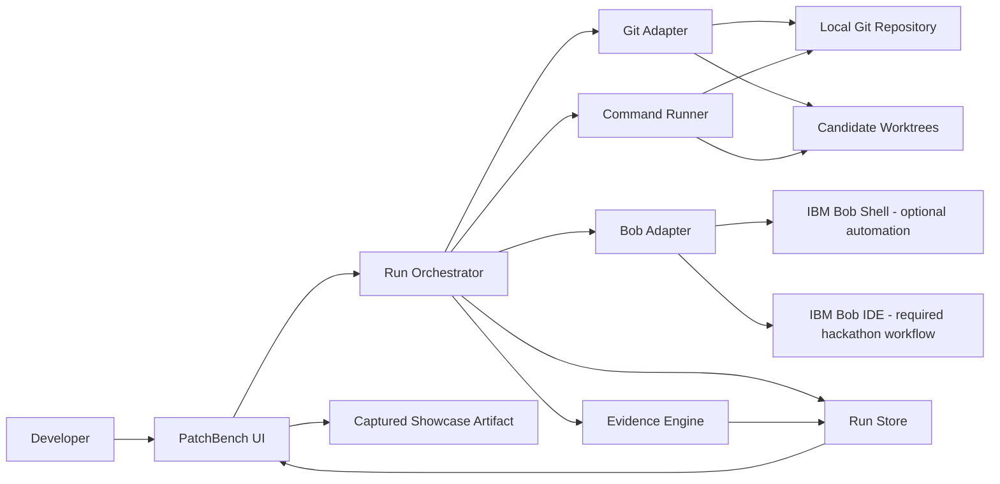
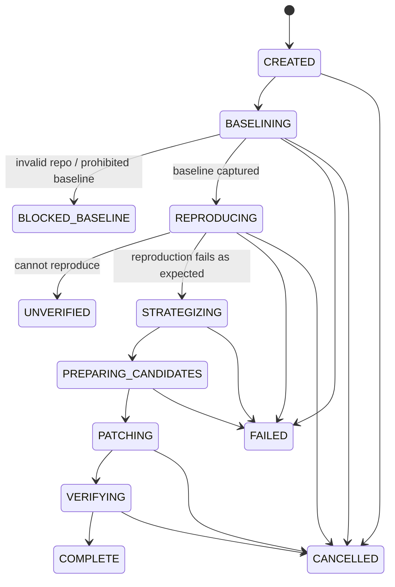

# PatchBench — Architecture

**Team:** Shipyard  
**Document type:** Hackathon implementation architecture  
**Architecture status:** MVP decisions locked; changes require a concrete implementation blocker  
**Primary constraint:** Deliver a reliable, demonstrable workflow in 48 hours with meaningful IBM Bob usage and a 40-Bobcoin solo budget.

---

## 1. Architecture Goals

PatchBench must optimize for five things, in this order:

1. **Correctness of the benchmark protocol.**
2. **A deterministic end-to-end demo.**
3. **Meaningful IBM Bob integration.**
4. **Fast local iteration during a 48-hour build.**
5. **A credible path from hackathon prototype to real developer tool.**

The architecture intentionally rejects infrastructure that does not strengthen those goals.

There is no production database, authentication system, distributed queue, billing layer, Kubernetes deployment, or multi-tenant cloud runtime in the MVP.

---

## 2. Critical Architectural Decision: Local-First

PatchBench executes arbitrary repository code: package scripts, tests, builds, and AI-generated changes.

That makes a conventional browser-only SaaS architecture a poor fit for the MVP.

The full benchmark engine therefore runs **on the developer's machine**.

The UI is a web application served locally, giving us a polished browser experience while retaining access to:

- the local filesystem;
- native Git;
- Git worktrees;
- Node child processes;
- the user's installed toolchain;
- IBM Bob Shell when enabled.

### Hosted submission URL

The submission still needs a public live URL.

The hosted deployment runs in **showcase mode**:

- renders the complete product UI;
- loads one or more **real captured PatchBench run artifacts** generated by the local engine;
- clearly labels them as captured demo runs;
- does not pretend to execute private repositories in Vercel/serverless infrastructure.

The demo video shows the real local end-to-end execution.

This is honest, safer, and substantially less brittle than deploying a privileged arbitrary-code runner during a 48-hour hackathon.

---

## 3. System Context



---

## 4. Technology Stack

Use boring technology unless a newer choice buys us something obvious.

### Runtime

- Node.js 22+;
- pnpm;
- TypeScript with `strict` enabled.

### Application

- Next.js App Router, current stable version at kickoff;
- React;
- Tailwind CSS;
- accessible primitive components (Radix/shadcn-style patterns);
- Lucide icons.

### Validation

- Zod for all external/process/model boundaries.

### Process execution

- `execa` or a thin wrapper over Node child processes;
- no shell string concatenation;
- argument arrays only.

### Git

Use native `git` commands through a typed adapter.

Reasons:

- worktree functionality is first-class;
- Git itself is the source of truth;
- fewer abstractions during a short build;
- commands are easy to reproduce in logs.

### Tests

- Vitest for unit/integration tests;
- Playwright for one end-to-end product flow;
- fixture repository for worktree/verification integration tests.

### Persistence

No database.

Use an append-safe filesystem run store:

```text
.patchbench/runs/<run-id>/
```

Artifacts are JSON/JSONL/text/patch files.

Reasons:

- zero setup;
- debuggable;
- portable;
- easy to commit a sanitized captured run to the hosted showcase;
- no schema migration work during hackathon.

---

## 5. High-Level Module Layout

```text
src/
├── app/                       # Next routes / pages / route handlers
│   ├── page.tsx               # New benchmark / landing
│   ├── runs/[runId]/page.tsx  # Live run + evidence
│   ├── demo/page.tsx          # Hosted captured run
│   └── api/
│       └── runs/              # Local orchestration API
├── components/
│   ├── benchmark/
│   ├── candidate/
│   ├── evidence/
│   ├── timeline/
│   └── shared/
├── domain/
│   ├── run.ts
│   ├── candidate.ts
│   ├── evidence.ts
│   ├── events.ts
│   └── policy.ts
├── server/
│   ├── runs/
│   │   ├── orchestrator.ts
│   │   ├── state-machine.ts
│   │   └── store.ts
│   ├── git/
│   │   ├── git-adapter.ts
│   │   └── worktrees.ts
│   ├── runner/
│   │   ├── command-runner.ts
│   │   ├── script-detector.ts
│   │   └── redaction.ts
│   ├── bob/
│   │   ├── adapter.ts
│   │   ├── shell-adapter.ts
│   │   ├── prompts.ts
│   │   └── schemas.ts
│   ├── reproduction/
│   │   └── reproduction-service.ts
│   ├── candidates/
│   │   └── candidate-service.ts
│   └── verification/
│       ├── verifier.ts
│       ├── diff-analysis.ts
│       └── evidence-builder.ts
└── lib/
    ├── ids.ts
    ├── time.ts
    └── result.ts
```

Architecture is modular without paying the complexity tax of a monorepo.

---

## 6. Domain Model

### 6.1 Run

```ts
type RunStatus =
  | "CREATED"
  | "BASELINING"
  | "REPRODUCING"
  | "STRATEGIZING"
  | "PREPARING_CANDIDATES"
  | "PATCHING"
  | "VERIFYING"
  | "COMPLETE"
  | "BLOCKED_BASELINE"
  | "UNVERIFIED"
  | "FAILED"
  | "CANCELLED";

interface PatchBenchRun {
  id: string;
  createdAt: string;
  updatedAt: string;

  repository: RepositorySnapshot;
  issue: IssueSpec;
  policy: RunPolicy;

  status: RunStatus;

  baseline?: BaselineResult;
  reproduction?: ReproductionResult;
  strategies: CandidateStrategy[];
  candidates: CandidateResult[];

  metrics: RunMetrics;
  failure?: RunFailure;
}
```

### 6.2 Repository snapshot

```ts
interface RepositorySnapshot {
  root: string;
  branch: string | null;
  commitSha: string;
  isDirty: boolean;
  packageManager: "pnpm" | "npm" | "yarn" | "unknown";
  detectedScripts: {
    test?: string;
    lint?: string;
    typecheck?: string;
    build?: string;
  };
}
```

### 6.3 Issue specification

```ts
interface IssueSpec {
  title: string;
  description: string;
  expectedBehavior: string;
  actualBehavior?: string;
  reproductionHints?: string;
  evidence?: string;
}
```

### 6.4 Candidate strategy

```ts
interface CandidateStrategy {
  id: string;
  title: string;
  rationale: string;
  likelyFiles: string[];
  tradeoffs: string[];
  implementationBrief: string;
}
```

### 6.5 Candidate result

```ts
type CandidateStatus =
  | "PENDING"
  | "IMPLEMENTING"
  | "IMPLEMENTED"
  | "VERIFYING"
  | "ELIGIBLE"
  | "REJECTED"
  | "FAILED"
  | "TIMED_OUT";

interface CandidateResult {
  id: string;
  strategyId: string;
  worktreePath: string;
  branchName: string;
  status: CandidateStatus;

  implementation?: {
    startedAt: string;
    finishedAt: string;
    bobTaskId?: string;
  };

  diff?: DiffSummary;
  verification?: VerificationResult;
  failure?: CandidateFailure;
}
```

### 6.6 Verification result

```ts
interface VerificationResult {
  regression: CheckResult;
  tests?: CheckResult;
  typecheck?: CheckResult;
  lint?: CheckResult;
  build?: CheckResult;

  newFailures: string[];
  baselineFailures: string[];

  diff: DiffSummary;

  hardGatePassed: boolean;
  rejectionReasons: string[];
}
```

---

## 7. Run State Machine

The orchestrator is an explicit state machine.

Do not bury orchestration in React components or ad hoc route handlers.



Each transition:

1. validates current state;
2. writes an event;
3. performs the operation;
4. persists its result;
5. writes a completion/failure event;
6. advances state.

That makes failures inspectable and demo progress easy to stream.

---

## 8. Event Model

Persist an append-only `events.jsonl`.

Example:

```json
{"seq":1,"type":"run.created","at":"..."}
{"seq":2,"type":"baseline.started","at":"..."}
{"seq":3,"type":"baseline.command.completed","name":"test","exitCode":0}
{"seq":4,"type":"reproduction.started","at":"..."}
{"seq":5,"type":"reproduction.confirmed","testFile":"..."}
{"seq":6,"type":"candidate.created","candidateId":"a"}
```

Benefits:

- live UI can render a timeline;
- partial failure remains debuggable;
- captured demo runs can be replayed;
- future CI integration gets a natural event stream.

---

## 9. The Benchmark Protocol

This is the most important architecture in the product.

### 9.1 Snapshot baseline

Record HEAD SHA and verification status before any generated code exists.

### 9.2 Create the reproduction on baseline

Bob is given:

- bug report;
- repository;
- strict instruction to add the smallest regression test possible;
- instruction **not to fix production code**.

The reproduction is only accepted if:

1. test file is syntactically valid;
2. the targeted test runs;
3. it fails on baseline;
4. failure matches the expected behavioral assertion.

If it accidentally passes, the run is unverified.

### 9.3 Freeze the reproduction artifact

Once accepted:

- store its patch/hash;
- revert the baseline workspace;
- inject that exact test patch into each candidate worktree.

Candidate agents are not allowed to modify/delete the regression test.

After implementation, PatchBench checks that the regression-test artifact still matches the frozen hash.

This is a major anti-cheating invariant.

### 9.4 Generate strategies before implementations

One planning step produces up to three materially different strategies.

A strategy validator rejects obvious duplicates.

### 9.5 Implement in isolation

Every candidate starts at the same `commitSha`.

No candidate branch is based on another.

### 9.6 Verify against identical policy

Same commands, timeouts, env allow-list, and frozen reproduction.

---

## 10. Git Worktree Design

### Worktree layout

```text
.patchbench/
├── runs/<run-id>/
└── worktrees/<run-id>/
    ├── a/
    ├── b/
    └── c/
```

Branches:

```text
patchbench/<run-id>/a
patchbench/<run-id>/b
patchbench/<run-id>/c
```

Creation:

```bash
git worktree add -b patchbench/<run-id>/a <path> <baseline-sha>
```

### Cleanup policy

On success:

- preserve until user explicitly cleans up;
- expose copyable checkout/diff commands.

On failure:

- preserve by default for debugging;
- provide cleanup action.

### Safety invariants

- refuse to create worktrees if target paths escape PatchBench runtime directory;
- sanitize run/candidate IDs;
- never `git reset --hard` the user's primary worktree;
- never auto-merge;
- never auto-push;
- never delete a non-PatchBench branch.

---

## 11. IBM Bob Integration

PatchBench uses an adapter boundary.

```ts
interface BobAdapter {
  generateReproduction(input: ReproductionInput): Promise<ReproductionProposal>;
  generateStrategies(input: StrategyInput): Promise<CandidateStrategy[]>;
  implementStrategy(input: ImplementationInput): Promise<ImplementationResult>;
}
```

### 11.1 Preferred adapter: Bob Shell

IBM Bob Shell supports non-interactive `bob run`, JSON/stream-JSON output, workspace selection, modes, turn caps, and Bobcoin cost caps.

PatchBench invokes it as a process, never through shell-concatenated strings.

Conceptual command:

```bash
bob run \
  --format json \
  --mode agent \
  --max-cost <bounded-cost> \
  --max-turns <bounded-turns> \
  --workspace <candidate-worktree> \
  <prompt>
```

Do not store credentials in PatchBench.

Bob Shell uses the user's configured Bob authentication.

### 11.2 IDE-first hackathon evidence

IBM Bob IDE remains central to the hackathon submission.

The repository contains:

- root `AGENTS.md`;
- `.bob/rules/`;
- mode-specific project rules;
- optional PatchBench-specific custom mode if time allows.

Use Bob IDE for implementation tasks and preserve session summary screenshots in `bob_sessions/`.

### 11.3 Fallback adapter

If Shell integration is unavailable:

`ManualBobAdapter`

PatchBench writes a task packet:

```text
.patchbench/runs/<run-id>/handoff/
├── reproduction-task.md
├── strategies-task.md
├── candidate-a-task.md
├── candidate-b-task.md
└── candidate-c-task.md
```

The user executes the packet in Bob IDE. Bob writes structured artifacts back to known paths.

This keeps the product functional and preserves the required Bob IDE workflow.

---

## 12. Bob Prompt Contracts

Prompts are code.

Version them.

```text
src/server/bob/prompts/
├── reproduction.v1.ts
├── strategies.v1.ts
└── implementation.v1.ts
```

### Reproduction contract

Must instruct Bob to:

- inspect relevant code/tests;
- add only a regression test/fixture required to prove the reported behavior;
- not modify production code;
- not loosen existing assertions;
- return a structured summary.

Expected structured payload:

```json
{
  "testFiles": ["tests/auth.refresh.test.ts"],
  "command": "pnpm vitest tests/auth.refresh.test.ts",
  "expectedFailure": "expected 401 but received 500",
  "notes": "..."
}
```

PatchBench validates this with Zod and independently runs the command.

### Strategy contract

Return exactly 2–3 distinct approaches.

No implementation.

### Implementation contract

Candidate receives:

- issue;
- reproduction details;
- one strategy only;
- immutable test paths;
- explicit permission to change production code;
- command budget.

It must not receive other candidate strategies/diffs.

---

## 13. Command Runner

All repository commands go through one boundary.

```ts
interface CommandSpec {
  command: string;
  args: string[];
  cwd: string;
  timeoutMs: number;
  env: Record<string, string>;
}

interface CommandResult {
  exitCode: number | null;
  stdout: string;
  stderr: string;
  durationMs: number;
  timedOut: boolean;
}
```

### Rules

- never use `exec("user input")`;
- arguments are arrays;
- cwd must be within repository/worktree allow-list;
- timeouts mandatory;
- maximum output size;
- stream output to event log;
- redact secrets before persistence;
- kill child process tree on cancellation/timeout.

### Script detection

Read `package.json`.

Suggested mapping:

- `test` → `pnpm test` / package-manager equivalent;
- `lint`;
- `typecheck`;
- `build`.

Allow the user to edit detected commands before run.

Do not invent commands silently.

---

## 14. Baseline Comparison

A pre-existing failing test must not automatically count as a candidate regression.

Record normalized baseline failures.

Candidate verification computes:

```text
newFailures = candidateFailures - baselineFailures
resolvedFailures = baselineFailures - candidateFailures
```

Hard-gate policy is based primarily on **new failures**, plus the frozen regression test.

This distinction makes PatchBench credible on imperfect real repositories.

---

## 15. Diff Analysis

Use Git as source:

```bash
git diff --numstat <baseline-sha>...HEAD
git diff --name-status <baseline-sha>...HEAD
git diff <baseline-sha>...HEAD
```

Derived evidence:

- files changed;
- insertions/deletions;
- package manifest/lockfile changed;
- migrations touched;
- public API paths touched;
- config files touched.

No AI is required to compute basic evidence.

Use Bob only where semantic reasoning adds value.

---

## 16. Evidence Engine

The Evidence Engine is deterministic.

It converts raw command/diff results into:

```ts
interface EvidenceMatrixRow {
  key: string;
  label: string;
  kind: "hard-gate" | "informational";
  candidateValues: Record<string, EvidenceValue>;
}
```

### Candidate eligibility

Pseudo-code:

```ts
const rejectionReasons = [];

if (!regression.passed) rejectionReasons.push("Regression test still fails");
if (newFailures.length > 0) rejectionReasons.push("Introduced new test failures");
if (policy.requireBuild && !build.passed) rejectionReasons.push("Build failed");
if (policy.requireTypecheck && !typecheck.passed) rejectionReasons.push("Typecheck failed");

candidate.hardGatePassed = rejectionReasons.length === 0;
```

No opaque weighted scoring in MVP.

---

## 17. Run Store

Filesystem layout:

```text
.patchbench/runs/<run-id>/
├── run.json
├── events.jsonl
├── baseline/
│   ├── result.json
│   └── logs/
├── reproduction/
│   ├── proposal.json
│   ├── regression.patch
│   ├── regression.sha256
│   └── result.json
├── strategies/
│   └── strategies.json
├── candidates/
│   ├── a/
│   │   ├── result.json
│   │   ├── diff.patch
│   │   └── logs/
│   ├── b/
│   └── c/
└── report.json
```

Writes use temp-file + rename where practical so `run.json` is not left partially written.

---

## 18. HTTP/API Surface

Local application only.

### `POST /api/runs`

Create a run.

### `GET /api/runs/:id`

Return current run state.

### `POST /api/runs/:id/start`

Begin orchestration.

### `POST /api/runs/:id/cancel`

Cancel running child processes and mark run.

### `POST /api/runs/:id/candidates/:candidateId/retry`

Retry a failed candidate from a clean worktree state.

### `GET /api/runs/:id/events`

Server-Sent Events stream.

SSE is chosen over WebSockets because the MVP only needs server → client progress updates.

---

## 19. Concurrency Model

Do not parallelize everything.

### Sequential

- baseline;
- reproduction;
- strategy generation;
- worktree setup.

### Parallel where safe

Candidate implementation can run concurrently **only if Bobcoin budget and Shell reliability allow it**.

Candidate verification can run concurrently with a low worker limit.

Default concurrency:

```text
implementation: 1 or 2
verification: 2
```

For the primary demo, reliability beats shaving 40 seconds.

---

## 20. Error Model

Every subsystem returns typed errors.

Examples:

- `REPO_NOT_GIT`
- `REPO_DIRTY`
- `SCRIPT_NOT_FOUND`
- `BASELINE_COMMAND_FAILED`
- `BOB_NOT_INSTALLED`
- `BOB_AUTH_REQUIRED`
- `BOB_COST_LIMIT_REACHED`
- `REPRO_NOT_CONFIRMED`
- `WORKTREE_CREATE_FAILED`
- `COMMAND_TIMEOUT`
- `REGRESSION_TEST_MUTATED`

Errors include:

- safe user-facing message;
- internal detail;
- recoverability;
- suggested next action.

The UI never dumps a raw stack trace as the primary error state.

---

## 21. Security Model

PatchBench is a code-execution tool. Treat that seriously even in a hackathon.

### Trust boundary

MVP supports:

- repositories the user created or explicitly trusts;
- synthetic fixture repo.

Before executing scripts in an unfamiliar repository, show a trust acknowledgement.

### Secrets

- do not read `.env` contents into model prompts;
- pass only explicitly allowed environment variables;
- redact patterns resembling tokens/passwords from stored logs;
- never persist `BOB_API_KEY`;
- `.patchbench/` is gitignored by default.

### Path safety

All file mutations must resolve beneath:

- repository root;
- PatchBench runtime directory;
- candidate worktree.

Use realpath checks to prevent traversal.

### Model-generated commands

Do not blindly execute arbitrary commands returned in prose.

PatchBench owns the command policy. Bob proposes code changes; the runner executes configured verification commands.

---

## 22. Bob Workspace Rules

Run `/init` once the scaffold exists, then edit generated guidance rather than treating it as untouchable.

Root `AGENTS.md` should capture:

- product purpose;
- benchmark invariants;
- architecture boundaries;
- test commands;
- "reproduce before repair";
- immutable regression-test rule;
- no database/auth scope;
- security constraints;
- 48-hour MVP priorities.

Suggested `.bob/rules/01-product-constraints.md`:

- never bypass the reproduction gate;
- never modify frozen regression tests during candidate implementation;
- never auto-merge or auto-push;
- prefer deterministic code over framework cleverness;
- preserve typed boundaries;
- tests required for orchestration logic.

Suggested `.bob/rules-agent/01-implementation.md`:

- implement only the requested milestone;
- run targeted tests first, then broader checks;
- do not add dependencies without justification;
- update architecture only when a decision changes.

Suggested `.bob/rules-plan/01-planning.md`:

- optimize for 48-hour scope;
- identify out-of-scope work;
- include rollback/fallback path for Bob integration;
- protect demo determinism.

---

## 23. Test Strategy

### Unit tests

State machine:

- valid transitions;
- invalid transitions;
- cancellation;
- failure mapping.

Evidence:

- baseline failure subtraction;
- hard-gate rejection;
- diff classification.

Validation:

- Bob output schemas;
- path sanitization;
- redaction.

### Integration tests

Use temporary Git repositories.

Test:

- worktree creation from identical SHA;
- frozen regression patch applied to all candidates;
- primary worktree never mutated;
- cleanup;
- command timeouts;
- baseline vs candidate failure comparison.

### Bob adapter tests

Do **not** burn Bobcoins in normal tests.

Use fixture JSON responses and a fake adapter.

One explicitly gated live-Bob smoke test may be used during the hackathon.

### E2E

One Playwright flow:

1. open PatchBench;
2. choose fixture;
3. submit bug;
4. run benchmark (fake Bob adapter in CI);
5. observe stages;
6. open evidence matrix;
7. inspect rejected candidate.

### Demo verification

Separately run one real Bob-backed end-to-end benchmark and capture its sanitized artifact.

---

## 24. Fixture Repository

Location:

```text
fixtures/auth-expiry-bug/
```

Requirements:

- TypeScript;
- fast package install;
- test suite under ~5 seconds;
- deterministic defect;
- at least two adjacent tests so a broad/wrong fix can regress behavior;
- no external network calls;
- no secrets;
- synthetic data only.

Primary defect:

> Expired refresh tokens return HTTP 500 instead of HTTP 401.

The fixture README contains:

- expected behavior;
- hidden explanation for Shipyard;
- reset command;
- known baseline SHA.

Do not expose the intended solution in prompts passed to candidates.

---

## 25. UI Architecture

### Pages

#### `/`

- concise value proposition;
- repository input;
- bug report form;
- detected verification commands;
- "Start benchmark."

#### `/runs/[runId]`

Hero live workspace.

Sections:

- stage timeline;
- baseline/reproduction card;
- candidate bench;
- evidence matrix;
- metrics.

#### Candidate detail drawer/page

- strategy;
- files changed;
- unified diff;
- verification results;
- command logs;
- rejection reasons.

#### `/demo`

Hosted captured run.

Prominent label:

> Captured real PatchBench run — execution performed locally.

### UI state

The browser does not own orchestration truth.

It renders persisted run state + events from the server.

Refreshing the page must not lose the run.

---

## 26. Visual System

Design target: **engineering instrument**, not AI toy.

### Color roles

- graphite background;
- off-white primary text;
- muted slate secondary text;
- signal amber for pending/running;
- verification green for pass;
- failure red for rejection;
- blue only for links/focus where useful.

Status always includes icon/text, never color alone.

### Typography

- UI: Geist Sans;
- code/metrics: Geist Mono.

### Components

- `RunStageRail`
- `BaselineCard`
- `ReproductionProof`
- `CandidateCard`
- `VerificationBadge`
- `EvidenceMatrix`
- `MetricStrip`
- `DiffViewer`
- `CommandLog`
- `FailureCallout`

### Motion

Minimal:

- progress pulse on currently running stage;
- row transition when a check resolves;
- no ornamental page animations.

---

## 27. Deployment Strategy

### Local full product

```bash
pnpm install
pnpm dev
```

Requirements:

- Git installed;
- Node/pnpm;
- IBM Bob Shell only for automated Bob path;
- Bob IDE for hackathon development/evidence.

### Hosted showcase

Deploy Next app to Vercel or equivalent free tier.

Environment:

```text
PATCHBENCH_MODE=showcase
```

In showcase mode:

- local execution endpoints disabled;
- bundled sanitized captured run available;
- demo screen fully interactive for browsing evidence.

No Bob credentials are deployed.

---

## 28. Observability

For MVP:

- structured JSON logs;
- run ID in every log entry;
- candidate ID where relevant;
- command duration;
- Bob invocation duration/cost metadata when output exposes it;
- no secrets/source blobs in global logs.

The run artifact itself is the primary observability record.

---

## 29. Performance Targets

Fixture benchmark:

- baseline: <10 s after dependencies installed;
- reproduction verification: <10 s excluding Bob generation;
- per-candidate verification: <15 s;
- UI update latency: <1 s after event persistence;
- initial page load: normal local-app performance.

Bob/model latency is measured separately.

---

## 30. Implementation Order

### Milestone 0 — Scaffold

- Next app;
- strict TypeScript;
- Vitest;
- domain schemas;
- visual shell;
- docs committed.

### Milestone 1 — Deterministic core without Bob

- run state machine;
- run store;
- command runner;
- Git adapter;
- fixture repo;
- fake Bob adapter.

Definition of done:

A fully deterministic benchmark can run with pre-authored reproduction/patch fixtures.

### Milestone 2 — Reproduction gate

- generated-test artifact model;
- frozen hash;
- baseline failure confirmation;
- mutation detection.

### Milestone 3 — Worktree candidates + verifier

- candidate worktrees;
- apply strategy artifacts;
- shared verification;
- evidence matrix.

### Milestone 4 — Real Bob adapter

- Shell detection;
- bounded `bob run`;
- structured prompt contracts;
- Zod validation;
- graceful fallback.

### Milestone 5 — UI polish

- live event stream;
- evidence-first run page;
- candidate details;
- error/retry states.

### Milestone 6 — Demo hardening

- real Bob fixture run;
- captured showcase artifact;
- Playwright pass;
- screenshot/session evidence;
- README;
- demo script.

Do not begin stretch features until Milestone 6 is green.

---

## 31. Hackathon Bobcoin Execution Plan

The architecture is deliberately testable with a fake Bob adapter so Bobcoins are spent on high-value work, not repeated end-to-end development runs.

Rules:

1. write deterministic engine first;
2. mock Bob outputs in tests;
3. use Bob IDE for meaningful implementation tasks and capture evidence;
4. integrate real Bob Shell after orchestration works;
5. run the full real demo only when fixture + verifier are stable;
6. cap Shell calls;
7. preserve at least 6 coins for final-day failures.

---

## 32. Repository Layout

```text
patchbench/
├── AGENTS.md
├── .bob/
│   ├── rules/
│   │   ├── 01-product-constraints.md
│   │   └── 02-engineering-standards.md
│   ├── rules-agent/
│   │   └── 01-implementation.md
│   └── rules-plan/
│       └── 01-planning.md
├── bob_sessions/
│   └── .gitkeep
├── docs/
│   ├── PRODUCT_BRIEF.md
│   ├── ARCHITECTURE.md
│   └── DEMO.md
├── fixtures/
│   └── auth-expiry-bug/
├── public/
├── src/
│   ├── app/
│   ├── components/
│   ├── domain/
│   ├── server/
│   │   ├── bob/
│   │   ├── candidates/
│   │   ├── git/
│   │   ├── reproduction/
│   │   ├── runner/
│   │   ├── runs/
│   │   └── verification/
│   └── lib/
├── tests/
│   ├── fixtures/
│   ├── unit/
│   ├── integration/
│   └── e2e/
├── scripts/
│   ├── capture-demo-run.ts
│   └── clean-runtime.ts
├── .gitignore
├── package.json
├── pnpm-lock.yaml
└── README.md
```

---

## 33. Architecture Decision Records

### ADR-001 — Local-first execution

**Decision:** run benchmarks on developer machine.  
**Why:** repository privacy, Git worktrees, arbitrary test execution, local Bob authentication.  
**Rejected:** privileged cloud code runner for MVP.

### ADR-002 — Filesystem persistence

**Decision:** JSON/JSONL run artifacts.  
**Why:** zero infrastructure, transparent debugging, showcase replay.  
**Rejected:** Postgres/SQLite for MVP.

### ADR-003 — Regression test before candidate implementation

**Decision:** reproduce and freeze test first.  
**Why:** common benchmark, prevents candidate-specific test gaming.  
**Rejected:** each candidate writes its own test.

### ADR-004 — Git worktrees

**Decision:** isolated worktree per candidate.  
**Why:** same baseline, native Git, inspectable diffs, no cross-candidate contamination.  
**Rejected:** sequential patch/revert in user's primary workspace.

### ADR-005 — Deterministic evidence, no composite score

**Decision:** hard gates + visible informational evidence.  
**Why:** avoids false precision and preserves developer agency.  
**Rejected:** opaque 0–100 "quality score."

### ADR-006 — Bob adapter boundary

**Decision:** model/Bob interactions behind `BobAdapter`.  
**Why:** testing without Bobcoin burn, Shell/IDE fallback, future agent providers.  
**Rejected:** Bob calls embedded directly in UI/orchestrator.

### ADR-007 — SSE for run updates

**Decision:** Server-Sent Events.  
**Why:** simple one-way progress stream.  
**Rejected:** WebSocket complexity.

---

## 34. Definition of Done

Architecture is successfully implemented when a fresh clone can:

1. install with one package-manager command;
2. run PatchBench locally;
3. benchmark the provided fixture;
4. prove the bug via a frozen failing regression test;
5. create three isolated candidates from the same SHA;
6. apply/produce candidate fixes;
7. run identical verification;
8. identify at least one deliberately bad/regressive candidate in the controlled demo;
9. preserve all evidence after refresh;
10. render a clean side-by-side matrix;
11. pass unit/integration/E2E tests;
12. export a sanitized captured run to the hosted showcase;
13. document Bob IDE usage with required `bob_sessions` screenshots;
14. complete without exposing secrets or modifying the user's primary worktree.

---

## 35. Final Engineering Rule

When forced to choose between:

- another feature,
- a clever abstraction,
- or a more reliable benchmark/demo,

choose the reliable benchmark/demo.

PatchBench wins by making the evidence undeniable.
